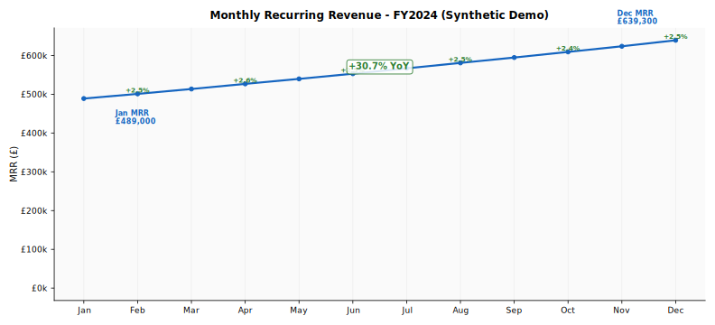
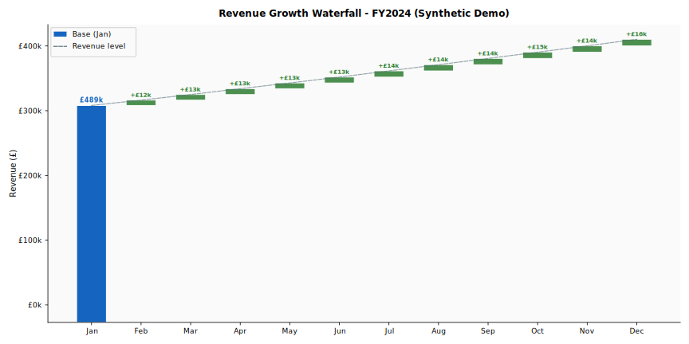
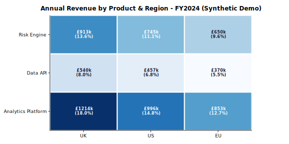
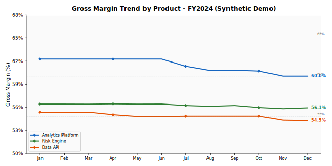
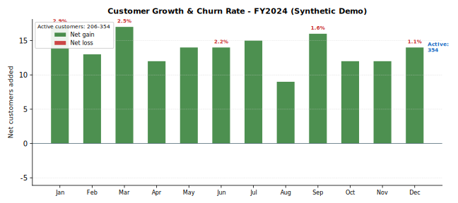
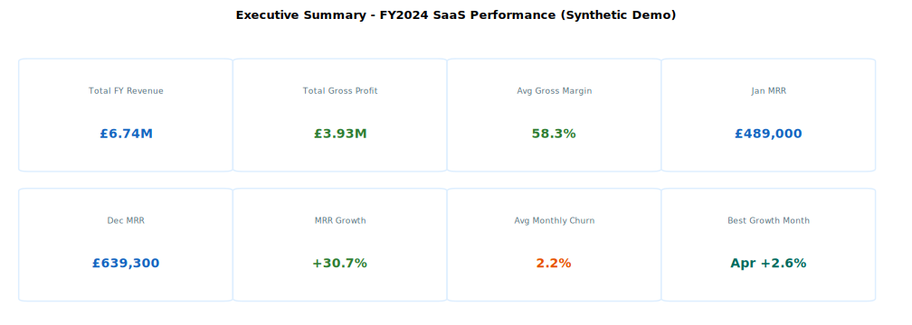
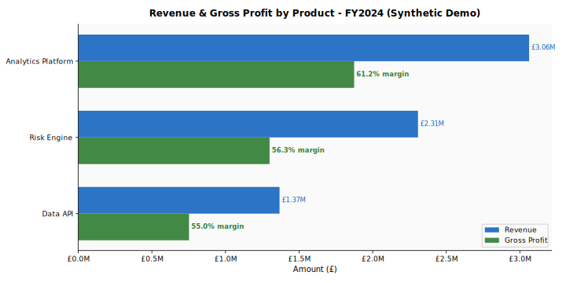

# Data Reporting Automation — Professional FinTech Management Reporting Suite

**Automated monthly management reporting pipeline for a FinTech SaaS company.**

> **Synthetic demo data only.** All figures are generated for portfolio demonstration and do not represent real business results.

## Overview

This pipeline takes a monthly CSV of SaaS operational metrics and produces:
- **9 professional SVG charts** optimised for web and PDF embedding
- **Executive management report** in structured Markdown
- **CSV data exports** for downstream analysis
- Fully automated with a single `python src/reporting_automation.py` command

## Key Findings (Synthetic Data)

| Metric | FY2024 Value |
|---|---|
| Total Annual Revenue | £6.74M |
| Total Gross Profit | £3.93M |
| Average Gross Margin | 58.3% |
| MRR Growth (Jan to Dec) | +30.7% |
| Average Monthly Churn | 2.2% |
| Active Customers (Jan to Dec) | 206 to 354 (+71.8%) |
| Largest Product | Analytics Platform (45.5% of revenue, 61.2% margin) |
| Largest Region | UK (39.6% of revenue) |

## Charts

### 1. MRR Trend


### 2. Revenue Waterfall


### 3. Stacked Revenue by Product


### 4. Product x Region Heatmap


### 5. Gross Margin Trend


### 6. Customer Growth & Churn


### 7. Regional Breakdown


### 8. Executive KPI Dashboard


### 9. Product Margin Comparison


## Pipeline Architecture

```
data/raw/monthly_saas_metrics.csv
         |
         v
ReportingPipeline
  1. load_data()      -- CSV ingestion + date parsing
  2. validate()       -- 7 data quality checks
  3. compute_kpis()   -- Monthly / product / region aggregation
  4. generate_charts() -- 9 SVG charts via matplotlib
  5. write_report()   -- Markdown report + CSV exports
         |
         v
reports/charts/*.svg
reports/monthly_management_report.md
reports/*.csv
```

## Usage

```bash
pip install matplotlib pandas numpy
python src/reporting_automation.py
```

## Technical Design

- `matplotlib.use('Agg')` — headless rendering, CI/CD compatible
- `rcParams['svg.fonttype'] = 'none'` — fonts as text, not paths
- `pcolormesh` for heatmap — no seaborn dependency
- SVG post-processing — strips verbose XML to keep files under 25KB
- `ReportingPipeline` class — independently callable and testable steps

*All data is entirely synthetic. Portfolio demonstration only.*
